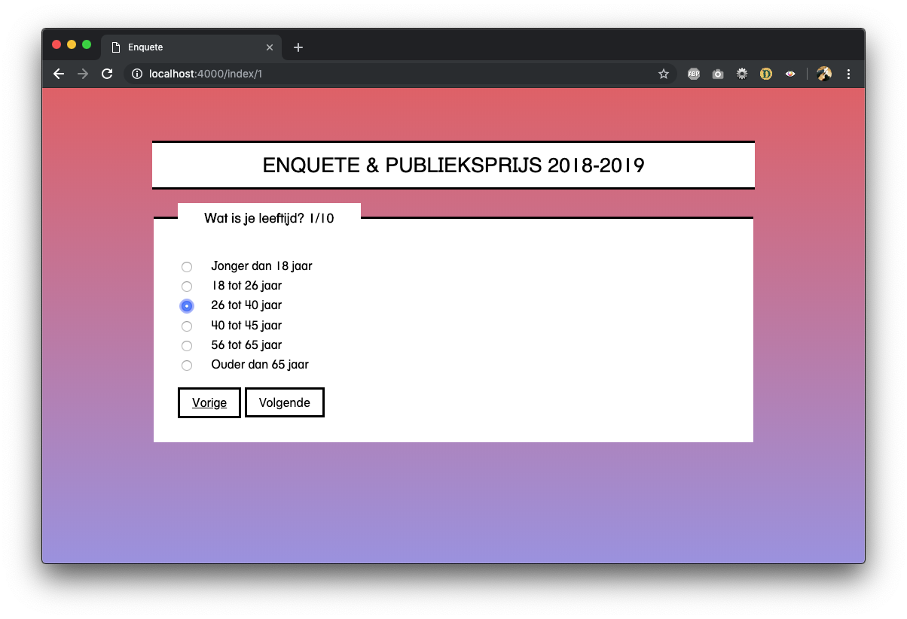

🎓 **Browser Technologies @cmda-minor-web-18-19**

## Progressive Enhanced Survey

Voor het vak Browser Technologies werkte ik aan de volgende case:

> Ik wil een enquete kunnen invullen, met verschillende antwoord mogelijkheden, als ik de enquete niet afkrijg, wil ik later weer verder gaan met waar ik ben gebleven.



Ik gebruikte de vragen uit de [enquete](https://amsterdamlightfestival.formstack.com/forms/enquete7) van [Amsterdam Light Festival](https://amsterdamlightfestival.com/nl).

## Functionaliteiten

| Functional                         | Reliable                                                    | Usable                                                           | Pleasurable                                                     |
| ---------------------------------- | ----------------------------------------------------------- | ---------------------------------------------------------------- | --------------------------------------------------------------- |
| 1. Antwoorden van Enquete invullen | 1. Feedback tijdens het invullen van bepaalde input velden. | 1. Laat vraag per scherm zien                                    | 1. Enquete is in de huisstijl van het Light Festival            |
| 2. Het formulier versturen         | 2. Feedback bij het versturen van een het formulier.        | 2. Bekijken hoeveel vragen je nog moet.                          | 2. Nice animaties.                                              |
| 3.                                 | 3.                                                          | 3. Een vraag kunnen overslaan om er later nog op terug te komen. | 3. De gebruiker herinneren welke vragen nog niet ingevuld zijn. |

## Toegankelijkheid

#### Kleur & Contrast

Uit de [Color Contrast Checker](https://webaim.org/resources/contrastchecker/) kwam een Contrast ratio van: 16.29:1, dat is voldoende op alle vlakken.

#### Custom fonts

Het custom font heeft genoeg fallback:

```
font-family: "HelveticaTextbook LT Roman", "Helvetica Neue", Helvetica, Arial,
  "Lucida Grande", sans-serif;
```

#### Muis

- Website kan volledig met toetsenbord worden bediend.
- Geeft focus op buttons & links.

#### JavaScript uit

De website werkt volledig zonder JavaScript.

#### Screenreader

Om met een screenreader te testen heb ik ChromeVox gebruikt. De pagina is goed te volgen met de sceenreader. Puntje van verbetering: de screenreader leest de button voor volgende en vorige vraag alleen als `volgende` of `vorige`. Dit is wellicht niet duidelijk genoeg voor een blinde gebruiker.

#### Verschillende browsers

Tijdesn het testen met verschillende browser kwam ik erachter dat:

- Dikte van het font in browsers verschillend is.
- De submit `button` in Safari en Firefox een grijze achtergrond krijgen.
- De scrollbalk in Firefox wel getoond.


## Feature detection

**CSS Gradients worden niet ondersteund door:**

- IE (8)
- Opera Mini (5.0 - 8.0)
  Oplossing:

```
background-color: purple;
background: linear-gradient(#e66465, #9198e5);
```

**Viewport Units worden niet gesupport door:**

- E (8,10,11),
- Edge (12,13),
- Opera (12.1),
- Opera Mini (5.0-8.0),
- Android Browser (4.2-4.3),
- IE Mobile (10,11),
- UC Browser for Android (9.9)

```
max-height: 1000px;
height: 70vh;
```

**Rem units worden niet gesupport door:**

- IE (8,10)

```
font-size: 16px;
font-size: 1rem;

```

**Text transform wordt niet gesupport door:**

- IE (8)
- Opera Mini (5.0-8.0)
  calc() as a CSS unit value wordt niet - gesupport door:
- IE (8),
- Opera (12.1),
- Opera Mini (5.0-8.0),
- Android Browser (4.2-4.3,4.4,4.4.3-4.4.4),
- UC Browser for Android (9.9)

```
?
```
