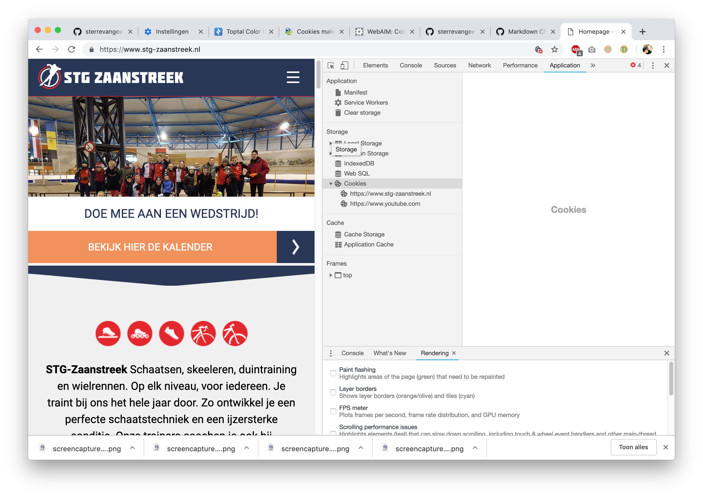
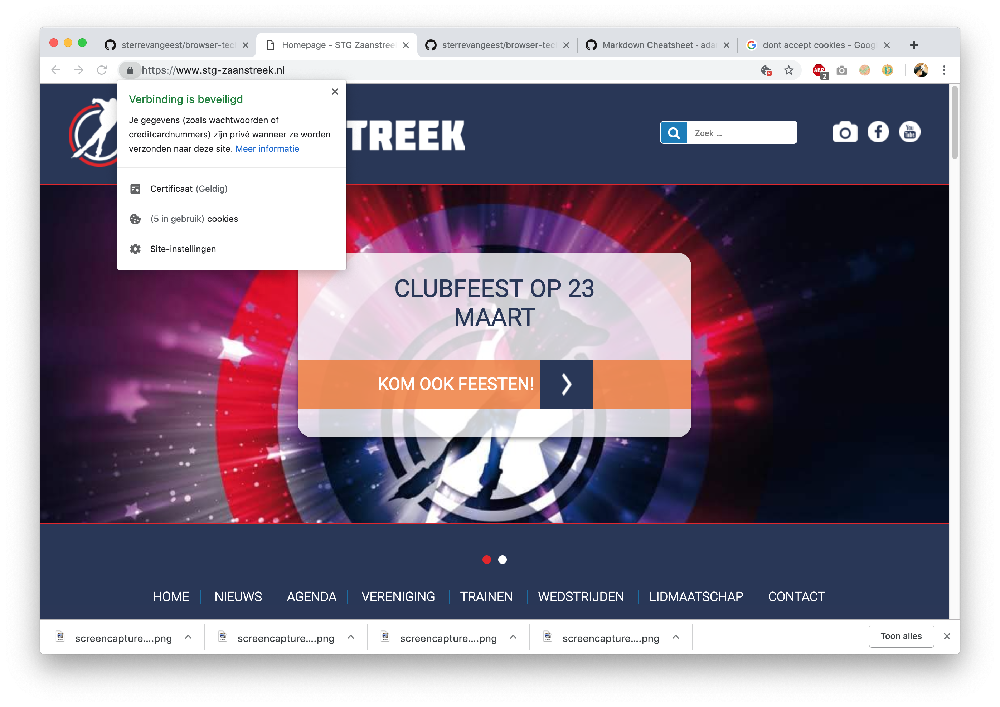
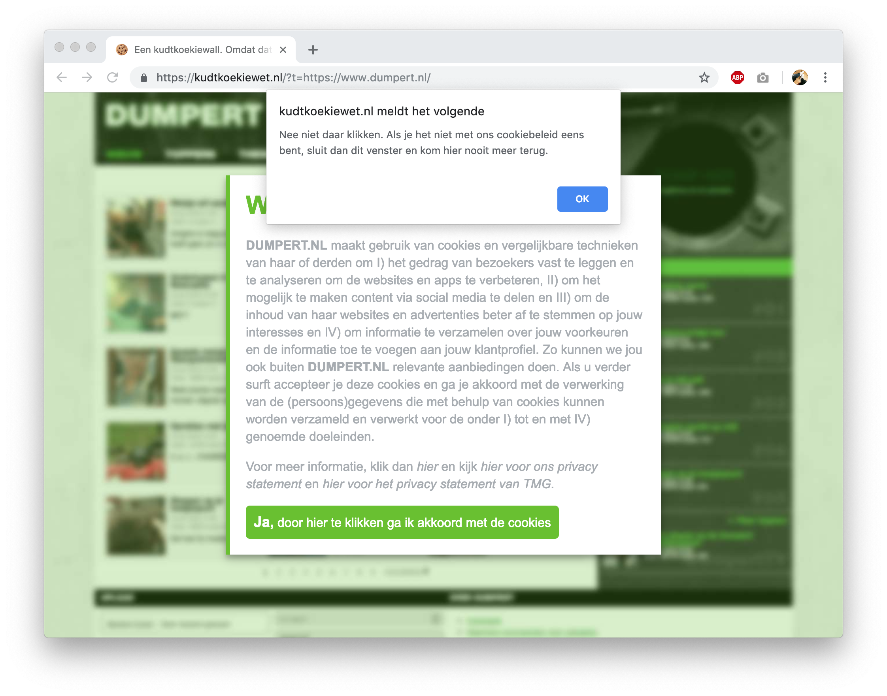
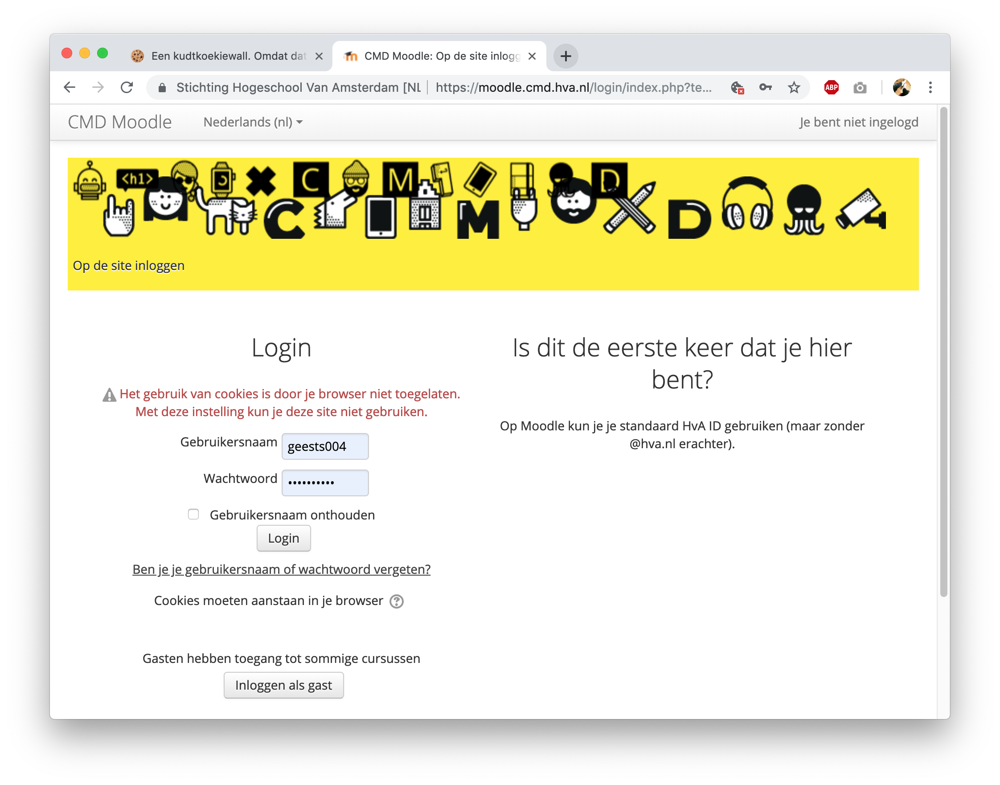
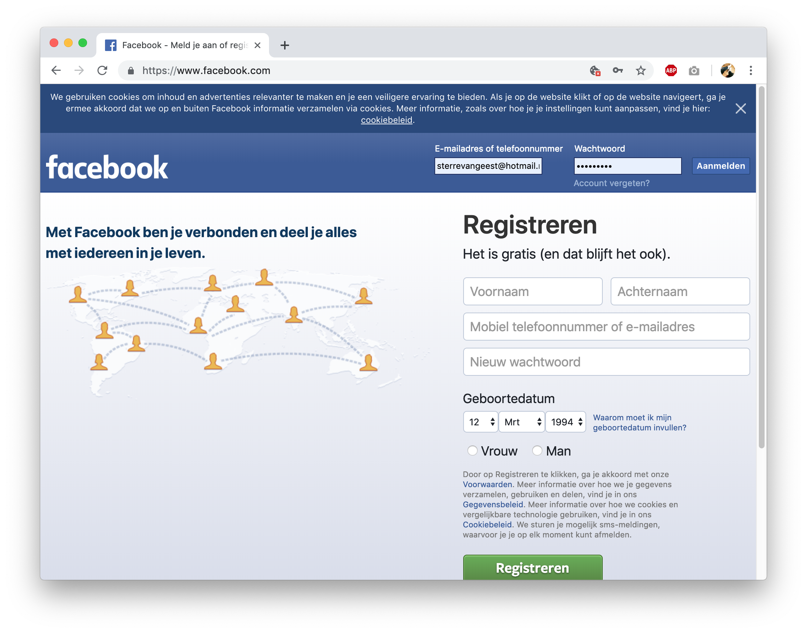
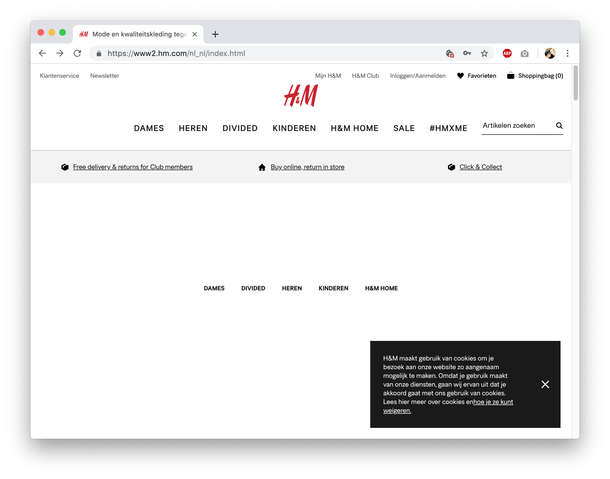

🎓 **Browser Technologies @cmda-minor-web-18-19**

# Opdrachten van Week 1

### **Inhoud**

<!-- 1. **[Opdracht 1.1 Breek het web](#kleur)** -->

**[Opdracht 1.1 | Breek het web](#kleur)**

- [Kleur & kleurenblindheid 🌈](#kleur)
- [ Cookies 🍪](#cookies)

**[Opdracht 1.2 | Fork je OBA](#opdracht2)**

## Opdracht 1.1 | Breek het web

#### Kleur & kleurenblindheid 🌈

#### 1. Wat voor problemen kunnen ze veroorzaken:

Voor kleurenblinde kunnen elementen op de website wegvallen waardoor zij bepaalde informatie kunnen missen.

#### 2. Hoe kun je dit testen?

Developer Tools voor Chrome: [Dalton for Chrome](https://chrome.google.com/webstore/detail/dalton/imknobcnmlabealhbhfhpbfodgbbdnfa) en [Let's Get Color Blind](https://chrome.google.com/webstore/detail/lets-get-color-blind/bkdgdianpkfahpkmphgehigalpighjck/related).

Website: [Topal Colorblind Web Page Filter](https://www.toptal.com/designers/colorfilter/)

Met deze tools/website kun je een website door de ogen van een een kleurenblinde.

#### 3. Voorbeelden uit mijn directe omgeving

https://www.idotwebengineers.nl/

http://www.king-wah.nl/

Rood op een donkere achtergrond zorgt ervoor dat op bepaalde plekken het contrast te laag is voor kleurenblinde (zie rechter afbeelding).

#### 4. Beschrijf hoe je dit kan fiksen.

**Tekst**

Zorg ervoor dat de kleur van de tekst en de achtergrondkleur genoeg contrast geven. Met [Color Contrast Checker](https://webaim.org/resources/contrastchecker/) kun je berekenen of het contrast hoog genoeg is.

> “WCAG 2.0 level AA requires a contrast ratio of 4.5:1 for normal text and 3:1 for large text (14 point and bold or larger, or 18 point or larger).”

##### Afbeeldingen en tekst:

Wanneer je tekst over een afbeelding plaatst, zorg dan dat je de helderheid van de afbeelding verhoogt.

**Link herkenning**

Een linkje moet je snel kunnen herkennen, ook zonder kleur. Gebruik iconen of een streep onder een link om linkjes te herkennen.

**Kleur combinaties**

Voorkom deze kleurcombinaties:

- groen/red
- groen/bruin
- blauw/paars
- groen/blauw
- licht groen/geel
- blauw/grijs
- groen/grijs
- groen/zwart

**Feedback**

Geef niet alleen met kleur feedback (bijv. rode tekst als iets mislukt is). Maar geef ook met iconen en/of tekst aan wat er aan de hand is.

Bron: [Smashing Magazine: Improving The Color Accessibility For Color-Blind Users](https://www.smashingmagazine.com/2016/06/improving-color-accessibility-for-color-blind-users/)

---

#### Cookies 🍪

> "Een cookie is een klein tekstbestand met informatie erop. Die informatie gaat over het gedrag van de gebruiker op de website. Bijvoorbeeld welke pagina’s deze gebruiker heeft bekeken en welke gegevens er zijn hebt ingevuld. De website-eigenaar kan deze informatie gebruiken als de gebruiker de site opnieuw bezoekt." Bron: [Consuwijzer](https://www.consuwijzer.nl/veilig-online/cookies)

#### 1. Wat voor problemen kunnen ze veroorzaken:

- Bij het weigeren van cookies kan het zijn dat geen toegang krijgt tot de website.
- Bij het weigeren van cookies kan het zijn dat niet alle alle functionaliteiten werken, bijvoorbeeld dat je een artikel niet kunt delen via social media.

#### 2. Hoe kun je dit testen?

Kies voor cookies weigeren en kijk of de website nog werkt.

Bekijk welke cookies een website gebruikt door:

1. Bekijk Cookies via Inspecteren > Application > Storage > Cookies 

2. Bekijk cookies via het icoontje naast de URL, klik op cookies en bekijk welke cookies de website gebruikt. 

#### 3. Voorbeelden uit mijn directe omgeving

- [dumpert.nl](https://kudtkoekiewet.nl/?t=https://www.dumpert.nl/) kun je niet bezoeken zonder alle cookies te accepteren.
  
- Op [Moodle](https://moodle.cmd.hva.nl/login/index.php?testsession=2960) kun je niet inloggen als je cookies niet accepteert.
  
- Op Facebook kun je niet inloggen zonder cookies te accepteren.
  
- H&M laat geen afbeeldingen zien wanneer je cookies niet accepteert.
  

#### 4. Beschrijf hoe je dit kan fiksen.

Bij het ontwikkelen van een website is het wel zo netjes/handig om je website ook toegankelijk te maken voor mensen die je cookies niet willen accepteren. Ookal werkt de website dan minder soepel.

---

## Opdracht 2

Analyse van [Oba Muziek op Maat](https://github.com/sterrevangeest/project-1-1819).

### Images

De afbeeldingen bovenaan de pagina zijn sfeerbeelden en worden dus niet heel erg gemist als deze uitgeschakeld worden. Maar de covers onderaan de pagina verdwijnen ook als de afbeeldingen worden geblokkeerd. Het is niet heel ernstig, de titel en het type van het item worden namelijk wel nog weergegeven. Toch kan de cover van een boek/cd/etc... wel aanvullende informatie geven over het item.

Oplossing: geef een `alt-text` mee aan het `img` element die de omslag van het boek beschrijft.

> Links: normaal , rechts afbeeldingen uit.

### Custom Fonts

Het font Montserrat wordt ingeladen via Google Fonts.

> (Perhaps the most important factor here) Google fonts are cached. This means that there is a relatively high chance that it has already been cached on your visitors computer, as there is a high chance that that same font has been used on another website, therefore it reduces page load time.

> Links: normaal , rechts font uit.

Ik gebruikte niet echt een fallback font. Behalve:

`font-family: "Montserrat", sans-serif;`

Beter is om meer fallback fonts toe te voegen:

`font-family: "Montserrat", "DejaVu Sans", Verdana, sans-serif;`

### Kleur

Via [Color Contrast Checker](https://webaim.org/resources/contrastchecker/) heb ik mijn website getest.
Resultaat: bijna alles heeft een te laag contrast. Behalve de zwarte tekst op de lichtrode achtergrond is hoog genoeg.

Ik kan dit oplossen door rood: `#FF3B30` donker rood te maken, moet minimaal dit worden: `#A30800` voor genoeg contrast op `#F7EEE7`.

### Muis

Op de beginpagina is goed te navigeren zonder muis. Op de pagina waar de gebruiker nummers kan kiezen, kan de gebruiker niet over de nummers heen met een tab. Omdat het geen linkjes/buttons zijn 😳.

### Breedband

Bij het laden met slow 3G, duurt het even voordat de pagina geladen wordt. Echter het ophalen van de data uit de OBA api duurt ontzettend lang op een langzame verbinding. Als de data al in de localStorage staat is de website een stuk sneller.

Na ongeveer 964ms worden de eerste 4 afbeeldingen geladen.

### JavaScript uit

Als JavaScript uit staat werkt het data ophalen niet, wat vrij essentieel is voor de website. Dit kun je oplossen door een server-side app te maken.

### Cookies

De website gebruikt geen Cookies.

### localStorage

De data die opgehaald moet worden uit de API wordt na de eerste keer ophalen meteen in de localStorage opgeslagen. Dit scheelt heel veel laadtijd als de gebruiker opnieuw laad. Maar de gebruiker kan nog steeds de pagina bezoeken wanneer localStorage uit staat.

### Verschillende browsers

Chrome vs. Safari vs. FireFox vs. Opera Mini

- Verschil in fontdikte per browser.
- Verschil in inputvelden/select
- In FireFox deed de API het niet...
- FireFox werkt minder zonder muis (skipt linkjes). Safari werkt helemaal niet met tabs

### Verschillende apparaten

De website is niet echt responsive. Dit merk je zodra je de website op andere apparaten opent. Je moet inzoomen om text etc. te kunnen lezen & bekijken.

## To Do's

- [x] Fallback font
- [ ] Responsive maken.
- [ ] Alt-text voor boeken etc.
- [ ] Zorgen voor een hoger contrast wat betreft kleuren.
- [ ] Elementen die moeten functioneren als linkjes of buttons ook daadwerkelijk `<a>` of `<button>` elementen maken.
- [ ] Voor JS uit: server side app maken
